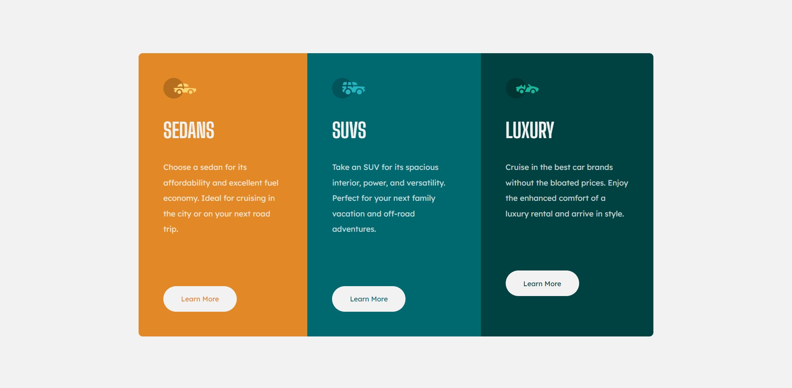
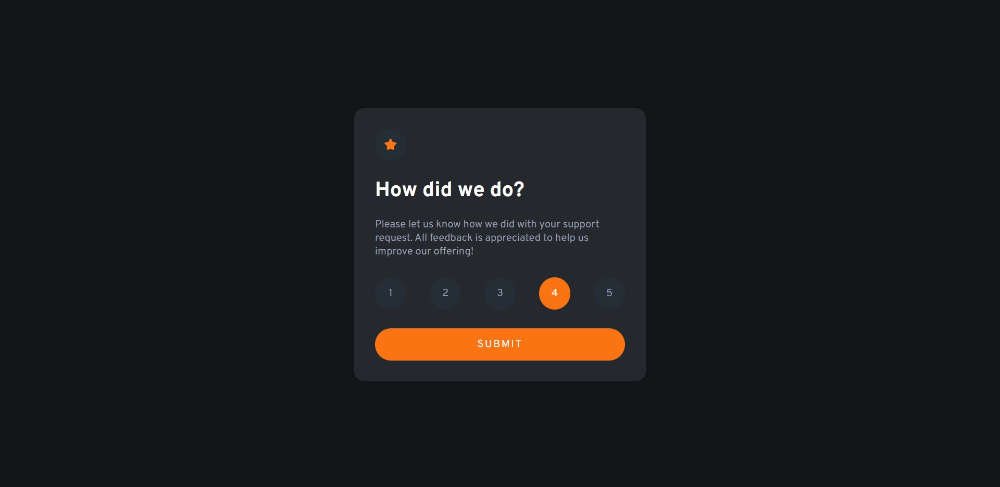
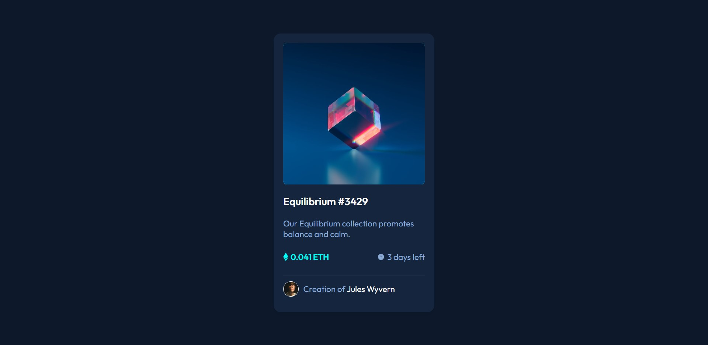
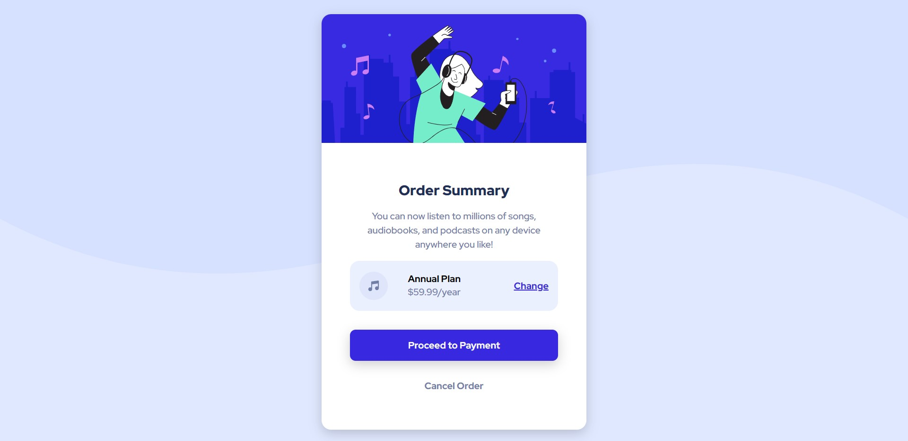
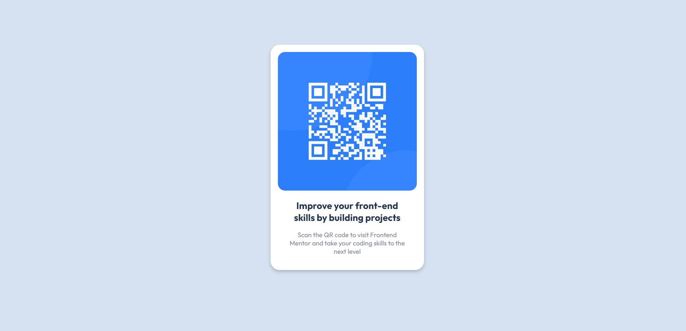
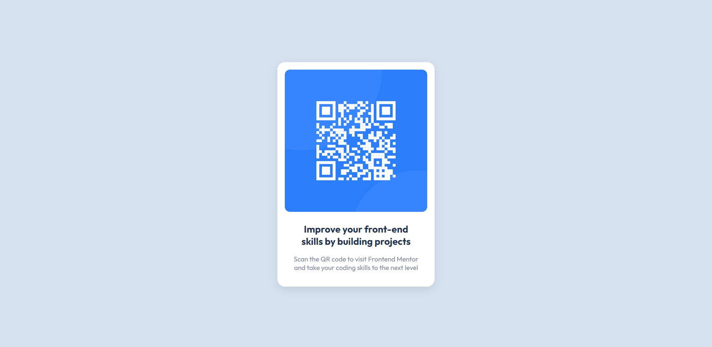

# Frontend Mentor Practice

This repository serves as a showcase of my journey in improving my technical skills through basic web development using HTML, CSS, and JavaScript. Here, you'll find a collection of simple web projects and exercises that I have undertaken to enhance my understanding of web development fundamentals.

## 3-Column-Preview-Card-Component

## Interactive-Rating-Component

## NFT-Preview-Card-Component

## Order-Summary-Card

## Profile-Card-Component

## QR-Code-Component-2

## QR-Code-Component

## Stats-Preview-Card-Component

